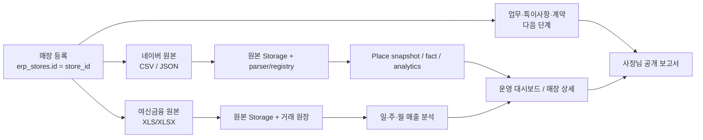

# 맞춤장사 OS — 마스터 인수인계

작성일: 2026-08-03  
저장소: `jangsamarketing-hub/Mkt.ERP`  
기준 브랜치: `recovery/stage-1c-store-registry`  
기준 커밋: `81d27e6` (`fix: include Naver JSON in period queries`)  
배포 서비스: Vercel / 운영 주소 `https://naver-place-marketing-erp.vercel.app`

> 이 문서는 다른 Codex, Claude, 개발자가 작업을 이어받을 때 가장 먼저 읽는 현재 기준 문서다. 기존 문서와 코드를 버리거나 대체하지 말고, 이 문서의 작업 단위에 맞춰 작은 브랜치/작은 PR로 이어간다.

---

## 1. 제품의 한 문장 정의

**맞춤장사 OS는 음식점 마케팅 대행사가 매장별 데이터를 한 `store_id`에 모으고, 직원의 반복 업무를 표준화하며, 사장님에게 성장 과정과 결과를 보여주는 내부 운영 ERP + 외부 공유 시스템이다.**

목표는 기능이 많은 SaaS가 아니라 다음 세 가지를 동시에 만드는 것이다.

1. 대표가 여러 매장의 위험·우선순위를 빠르게 판단한다.
2. 직원이 매장별 업무를 놓치지 않고 같은 방식으로 수행한다.
3. 사장님이 우리가 한 일, 본인이 할 일, 매장의 변화 데이터를 읽기 쉬운 링크에서 확인한다.

### 절대 원칙

- 기존 장사닥터 ERP의 **업체 관리 / 일일 업무 / 올인원 / 관리용 페이지** 흐름을 가볍게 재구성한다. 기존 UI와 업무 흐름을 폐기하지 않는다.
- 모든 운영 데이터는 `erp_stores.id` 하나(`store_id`)에 연결한다.
- 원본 파일, 파싱 결과, 분석 스냅샷, 화면 조회 모델을 분리한다.
- 데이터 없음·미수집·부분수집·실제 0을 절대 같은 값으로 취급하지 않는다.
- 여신금융의 마스킹 카드번호는 실제 개인 고객 식별자가 아니다. “첫 관측/반복 관측 결제 패턴”으로만 보수적으로 표현한다.
- 자동화는 `조회 → 저장 → 추천 → 관리자 승인 → dry-run → 제한 실행 → 검증/원복` 순서를 지킨다.
- 외부 계정 비밀번호, API Secret, Service Role Key는 코드·DB 평문·문서·채팅에 저장하지 않는다.

---

## 2. 현재 개발 상태 요약

### A. 실제 DB/Storage 연결이 있는 기능

| 영역 | 현재 상태 | 핵심 위치 |
|---|---|---|
| 관리자 로그인 경계 | 구현됨. API와 페이지의 기본 인증 경계 및 감사 기반 있음 | `lib/auth/`, `app/api/auth/`, `proxy.ts` |
| 매장 원장 | 구현 중이지만 실제 CRUD API와 `store_id` 기준 선택기는 있음 | `app/api/erp/stores/`, `components/stores/store-registry-context.tsx` |
| 매장 비공개 정보 | 사장님 연락처, 사업자번호, 특이사항, 사업자등록증 파일 저장 API 있음 | `app/api/erp/stores/[storeId]/private-profile/`, `business-registration/` |
| 월별 세팅 | 관리월 생성·수정·삭제를 DB에 저장 | `app/api/erp/stores/[storeId]/setup/` |
| 네이버 CSV | 원본 Storage 보관 + 기간/키워드/채널/시간/요일 행 적재 | `app/api/erp/place-uploads/`, `lib/place-csv/parser.ts` |
| 네이버 JSON | 원본 Storage registry와 기간/요약 조회 연결 | `app/api/erp/naver-json-uploads/`, `app/api/erp/place-uploads/` |
| 여신금융 XLS/XLSX | 원본 Storage 보관 + 거래 원장/일자·시간 집계 | `app/api/erp/card-uploads/`, `lib/credit-finance/parser.ts` |
| 과거 매출 이관 | CSV/JSON 검수와 매장 연결 전 미리보기 | `app/admin/imports/jangsadoctor/`, `lib/jangsadoctor/` |
| 공개 링크 | MID 기반 사장님 일일 보고서/정보안내문 URL의 기본 뼈대 | `app/store/[mid]/daylist/`, `app/store/[mid]/info/` |

### B. 화면은 있으나 브라우저 임시 저장 또는 예시 중심인 기능

| 영역 | 현재 상태 | 다음 조치 |
|---|---|---|
| 관리자 일일업무 | 화면과 체크 흐름은 있으나 업무 원장 DB가 아님 | `store_tasks`, 완료 이벤트, 증빙 테이블로 이전 |
| 매장별 주간 업무 | 일부 localStorage 기반 | 업무 템플릿·계약 주차·수동 추가·완료 증빙 DB화 |
| 내부 특이사항·통화 히스토리 | 브라우저 임시 저장 포함 | 매장 메모/통화/업무 후보를 DB·Storage로 이전 |
| 키워드 조합·꿀키워드 히스토리 | 조합 UI와 일부 localStorage | 조합 실행/결과/승인 이력 DB화 |
| 사장님 보고서 | 공개 페이지 뼈대. 모든 실데이터 통합 전 | 읽기 전용 DTO와 만료 토큰으로 연결 |
| 네이버 광고 | 화면 예시·조회 보조 수준 | 먼저 Read-only 1계정/1캠페인 snapshot |
| 순위 추적·리뷰 분석 | 아직 구현 전 | 데이터 원장 완성 후 별도 단계 |

### C. 최신 분석 화면 반영 사항

- **여신금융 매출**: 시작일/종료일을 정하고 `조회`하면 그 기간에 있는 원본 거래만 표시한다. 일간·주간·월간 묶음 전환이 있다.
- **네이버 유입**: 시작일/종료일 조회, 기간별 유입 요약, CSV와 JSON 기간 원본 조회가 있다.
- 같은 기간의 CSV와 JSON이 함께 있으면 JSON을 우선해 합계가 중복되지 않도록 처리한다.
- 그래프 위에는 선택 기간과 핵심 합계가 보이도록 구현되어 있다.

### D. 아직 완료로 말하면 안 되는 것

- 여러 매장이 반복 사용해도 안정적인 “등록 → 즉시 목록 선택 → 업로드” 전체 흐름
- 네이버 JSON의 세부 모듈(성별·연령·키워드·시간대)을 정규 분석 테이블로 완전 적재
- 운영 대시보드와 상세 분석 화면의 수치 일치 검증
- 업무/특이사항/주간 보고서의 다중 브라우저 동기화
- 계약/전자서명, 검색광고 API, 30분 CPC 자동조정, 순위 자동수집, QR CRM, 상권 분석

---

## 3. 현재 즉시 처리 중인 변경 사항 — 반드시 보존

작업 트리에 아직 커밋되지 않은 파일이 있다. 다른 작업자는 이 변경을 덮어쓰거나 버리지 말고 먼저 빌드·검토한다.

| 파일 | 변경 목적 | 상태 |
|---|---|---|
| `lib/stores/organization.ts` | 최초 설치에 활성 organization이 없을 때 `맞춤장사 OS` 기본 조직을 안전하게 생성 | 미커밋 |
| `app/api/erp/stores/route.ts` | 단일 매장 등록 시 기본 organization 자동 준비 | 미커밋 |
| `app/api/erp/stores/bulk/route.ts` | 업체명 일괄 등록 시 기본 organization 자동 준비 | 미커밋 |
| `components/stores/store-info-page.tsx` | 매장 저장을 await하고 저장 중/성공/실패 상태를 화면에 표시 | 미커밋 |
| `app/page.tsx` | 매장 저장 API 결과를 UI에 반환하고, 성공 후 목록 갱신·자동 선택을 명확히 처리 | 미커밋 |

### 이 변경의 완료 기준

1. `업체 추가`에서 업체명만 입력하고 저장한다.
2. “매장 원장 저장 완료 · 목록과 업로드 선택기에 추가했습니다.”가 표시된다.
3. 네이버 유입·여신금융 매출의 매장 선택기에서 즉시 선택할 수 있다.
4. 선택 후 파일 업로드가 “업체명을 먼저 입력” 오류 없이 해당 `store_id`에 저장된다.
5. 오류가 있으면 성공 문구가 아니라 실제 오류 문구가 보인다.

---

## 4. 데이터 구조와 흐름



### 핵심 테이블/저장소

| 구분 | 이름 | 용도 |
|---|---|---|
| 기준 매장 | `erp_stores` | 모든 데이터가 연결되는 단일 `store_id` 원장 |
| 권한 기반 | `organizations`, `profiles`, `organization_members`, `store_members` | 조직/직원/매장 소속 확장 기반 |
| 외부 식별자 | `store_external_identifiers` | MID, Place ID, SearchAd Customer ID, 여신 MID/그룹 등 |
| 네이버 CSV | `erp_place_csv_uploads`, `erp_place_*_rows` | 업로드 원본 메타와 세부 지표 |
| 네이버 JSON | `erp_naver_place_json_imports` | JSON raw 원본/기간/상태 registry |
| 여신금융 | credit-finance migrations가 생성한 import/transaction/daily/time summary tables | 승인·취소·순매출·결제건수 |
| 비공개 매장 정보 | `erp_store_private_profiles` 등 관련 migration 테이블 | 사장님 연락처·사업자번호·특이사항 |
| 월 세팅 | `erp_store_setup_months`, 관련 item 테이블 | 관리월별 세팅 진행률 |
| Storage | `erp-private-uploads` | CSV/JSON/XLS 및 사업자등록증 원본 |

### 데이터 정확도 규칙

- 월간 네이버 JSON은 월간 원본이다. 임의로 주간 값으로 쪼개지 않는다.
- 업로드 기간 밖의 값은 `0`이 아니라 “원본 없음/미수집”이다.
- 같은 원본 파일은 checksum 또는 원본 식별값으로 중복 방지한다.
- 같은 기간의 서로 다른 원본은 덮어쓰기 전에 버전·우선순위·감사 이력을 남긴다.
- 카드 마스킹 값은 개인 고객 확정값이 아니며, 보고서에서 “신규 고객”이라는 표현을 사용하려면 주석과 기준을 명시한다.

---

## 5. 화면 및 코드 지도

| 기능 | 진입 화면/코드 | 참고 |
|---|---|---|
| 전체 운영 대시보드 | `app/page.tsx` → `Dashboard` | 매장 목록·신호등·기간 단위 비교 |
| 네이버 유입/키워드 | `app/page.tsx` → `InflowPage` | CSV/JSON 업로드와 기간 조회 |
| 여신금융 매출 | `app/page.tsx` → `SalesPage` | XLS/XLSX 업로드와 일·주·월 분석 |
| 매장 정보 | `components/stores/store-info-page.tsx` | 매장 기본/비공개/세팅/업로드 진입 |
| 매장 선택 상태 | `components/stores/store-registry-context.tsx` | 목록 fetch, `storeId` URL 상태 |
| 관리자 일일업무 | `components/daily-tasks/daily-tasks-page.tsx` | 현재 DB 이전 대상 |
| 공개 보고서 | `app/store/[mid]/daylist/page.tsx` | 로그인 없는 공개 페이지 |
| 공개 정보안내문 | `app/store/[mid]/info/page.tsx` | MID 기반 공개 페이지 |
| API/DB 접근 | `app/api/erp/` + `lib/supabase/admin.ts` | service role은 서버 route에서만 사용 |
| DB 변경 | `supabase/migrations/` | 항상 rollback SQL도 함께 추가 |
| 테스트 | `tests/` | parser, 계약, auth, registry fixture 테스트 |

### 실행과 검증

```bash
npm install
npm run build
npm test
npm run check:secrets
```

배포 전에는 반드시 Preview에서 확인한다. 운영 배포는 대표 승인 없이는 하지 않는다.

---

## 6. 권장 개발 순서

### P0 — 매장 등록/선택/업로드 안정화 (지금 즉시)

목적: 사장님 매장을 한 곳씩 등록하고 해당 매장에 파일을 올릴 수 있게 만든다.

- 현재 미커밋 변경을 빌드·테스트한다.
- 실제 Supabase에서 organization/`erp_stores`가 조회되는지 확인한다.
- 온돌오리구이 하남미사본점으로 매장 등록 → 네이버 월간 JSON → 여신 월간 XLS 업로드를 검증한다.
- 등록 후 목록, 네이버 선택기, 여신 선택기에 모두 나타나는지 확인한다.

**완료 조건:** 사용자가 매장명만 입력해도 등록되고, 새로고침 후에도 남으며, 두 업로드 화면에서 바로 선택 가능하다.

### P1 — 분석 조회 정확도 완성

목적: “업로드했는데 대시보드에서 안 보임” 문제를 끝낸다.

- 네이버 CSV/JSON summary를 기간별 read model로 통일한다.
- 여신 import/transaction/date summary가 같은 날짜 범위를 사용하게 한다.
- 운영 대시보드의 일/주/월 모드와 상세 화면 숫자를 비교 검증한다.
- 차트에 기간·매출·결제건수 또는 유입·원본 수를 그래프 상단에 표시한다.
- 누락 기간은 0으로 채우지 않고 경고한다.

**완료 조건:** 온돌오리구이 원본 파일의 기간·합계와 운영 대시보드/상세 화면의 수치가 일치한다.

### P2 — 업무 원장 DB화

목적: 일일업무, 주간업무, 특이사항이 다른 브라우저에서도 유지되고 사장님 보고서와 연결된다.

- `task_templates`, `store_tasks`, `task_events`, `task_attachments`, `store_notes` 설계
- 담당자/업무 주체(우리회사·사장님·매장직원)/마감일/완료 시각/증빙 링크 저장
- 4주 28일 템플릿, 재계약 연장, 수동 업무 추가
- 오늘 요일에 맞춘 기본 탭과 매장별 완료율

**완료 조건:** 직원이 완료 처리한 업무와 사진/텍스트 증빙이 다른 브라우저와 공개 보고서에 반영된다.

### P3 — 사장님 보고서/정보안내문 완성

목적: 매장별 공개 링크가 실제 일일 공유 도구가 된다.

- MID만으로 충돌하지 않는 공개 토큰/만료시간 설계
- 업무, 진행률, 특이사항 중 공개 가능 항목, 네이버·매출 요약을 읽기 전용 DTO로 제공
- 정보안내문 답변과 진행률을 DB 저장
- 영업용 2시간 한정 공유 링크는 별도 snapshot token으로 설계

**완료 조건:** 로그인 없이도 해당 매장만 보이고, 내부 비밀정보는 절대 노출되지 않는다.

### P4 — 계약/전자서명

목적: 결제 전 단계의 계약 전달·서명·연장 업무를 표준화한다.

- 계약 템플릿 버전, 계약 인스턴스, 서명 이벤트, 문서 hash, 감사 로그
- 결제는 초기에는 수기 확인만. Toss Payments는 별도 후속 단계

### P5 — 순위 추적/리뷰 분석/키워드 원장

목적: 매장 관리에 필요한 선행지표를 쌓는다.

- 목표 키워드, 날짜별 순위 snapshot, 성별/연령, 리뷰 100개 분석, 키워드 조합 실행 이력
- 순위 자동수집은 별도 worker 이후에만. 초기에는 수동/반자동 원본 import 가능하게 설계

### P6 — 검색광고 Read-only → 승인형 자동화

1. 1계정/1캠페인/1그룹 조회 snapshot
2. 캠페인 성과/예산/CPC/평균순위 표시
3. 설정 추천과 관리자 승인
4. dry-run
5. 제한 실행
6. 프리미엄 30분 CPC 조정은 마지막 단계

### P7 — 상권 진단, QR CRM, 알림, EXIT 리포트

- 상권 분석은 최초 1회 진단 + 월 1회 보강 원칙
- QR CRM은 개인정보 동의·자발적 리뷰 안내 원칙을 지킨다.
- 알림은 이메일/Slack부터, 비용과 동의 확인 후 카카오 알림으로 확장한다.

---

## 7. 동시 작업 규칙 (Codex/Claude 공통)

### 브랜치 규칙

- 기준 브랜치: `recovery/stage-1c-store-registry`
- 작업자는 하나의 목표만 가진 새 브랜치에서 작업한다.
- 브랜치 예시: `fix/store-registration-flow`, `feat/task-ledger`, `fix/dashboard-read-model`
- 동시에 두 작업자가 `app/page.tsx`를 크게 수정하지 않는다. 충돌 가능성이 가장 높다.

### 권장 분업

| 작업자 | 맡을 범위 | 건드리지 말 것 |
|---|---|---|
| A | 매장 등록/API/Registry | 분석 UI 대규모 변경 |
| B | 네이버·여신 read model/집계/API | 매장 CRUD와 migration 동시 변경 |
| C | 업무 원장 schema/API | `app/page.tsx`의 기존 분석 로직 |
| D | 공개 보고서/정보안내문 UI | service-role 환경변수/DB 직접 변경 |

### 작업 전 필수 확인

1. `git status --short`로 미커밋 변경 확인
2. 이 문서의 “현재 즉시 처리 중인 변경 사항” 확인
3. 관련 migration과 rollback SQL 확인
4. 대상 화면의 데이터가 DB인지 localStorage인지 구분
5. 실제 원본 fixture로 테스트 추가 또는 기존 테스트 실행

### 작업 후 필수 산출물

- 변경 파일 목록
- DB migration + rollback (DB 변경이 있는 경우)
- `npm run build`, `npm test` 결과
- Preview URL 또는 확인 방법
- 위험·롤백 방법
- 다음 작업에 넘길 미완료 항목

---

## 8. 보안 및 운영 금지사항

- 서비스 계정 키, DB 비밀번호, 외부 플랫폼 로그인 비밀번호를 채팅·Git·문서에 적지 않는다.
- 기존 초기 기획에 있던 “평문 비밀번호 저장” 요구는 보안상 구현하지 않는다. 외부 계정 접근은 승인된 비밀관리 방식 또는 수동 운영 링크로 대체한다.
- 사장님 공개 링크에는 연락처, 사업자번호, 내부 메모, 계정 정보, 원본 거래내역을 절대 노출하지 않는다.
- 광고 API는 승인 전 write 요청을 보내지 않는다.
- 여신금융 카드 마스킹 값으로 고객 개인을 확정하거나 과장된 재방문율을 보여주지 않는다.
- 소상공인365/지오비전/나이스 등 외부 데이터는 출처·기준일·범위를 표시하고, 무단 대량 수집 전에 이용 조건을 확인한다.

---

## 9. 기존 자료의 위치

| 자료 | 위치 |
|---|---|
| 현재 프로젝트 PRD | `prd.md` |
| 화면/기능 통합 문서팩 | `docs/handoff-2026-07-19/` |
| Stage 0~1 감사/스키마 문서 | `docs/recovery/` |
| 제품 작업 지시서 | `docs/product/IMPLEMENTATION_WORK_ORDERS.md` |
| 주간 데이터 업로드 정책 | `docs/product/WEEKLY_DATA_INGESTION_POLICY.md` |
| 시각 레퍼런스 인덱스 | `docs/handoff-2026-07-19/08_VISUAL_REFERENCE_INDEX.md` |
| Supabase migration | `supabase/migrations/` |
| rollback SQL | `supabase/rollbacks/` |
| 테스트 | `tests/` |

---

## 10. 다음 작업자에게 보내는 시작 문구

```text
이 저장소는 맞춤장사 OS다. 먼저 docs/HANDOFF_MASTER_2026-08-03.md를 읽고,
현재 브랜치와 git status를 확인해라. 기존 UI와 store_id 원칙을 보존한다.

지금은 P0 매장 등록/선택/업로드 안정화만 진행한다.
등록 직후 새 매장이 목록·네이버 유입·여신금융 매출 선택기에 나타나야 하며,
온돌오리구이 하남미사본점으로 네이버 월간 JSON과 여신 월간 XLS 업로드를 검증한다.

코드 변경 전에는 현재 미커밋 5개 파일을 검토하고, DB/Storage/화면 상태를 구분해라.
완료 후 build/test, 변경 파일, Preview URL, 실제 검증 결과, 롤백 방법만 보고하고 멈춰라.
```
