# 페이지별 로직 명세

이 문서는 현재 화면과 최종 목표를 함께 설명한다. `현재 저장` 항목이 `localStorage`면 해당 기능은 다른 PC/직원과 공유되지 않는다.

## 1. 운영 대시보드

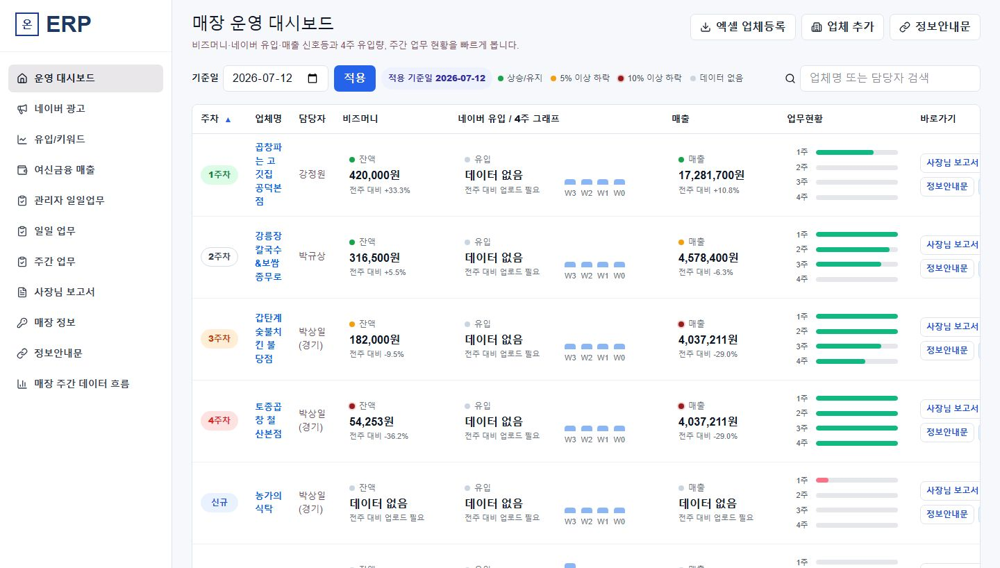

### 목적

대표와 관리자가 모든 매장의 위험과 4주 흐름을 한 표에서 확인한다.

### 입력

- 기준일
- 검색어
- 표 헤더 정렬: 주차, 업체명, 담당자, 비즈머니, 플레이스 유입, 매출
- 추후 업종/담당자 필터

### 처리 로직

1. 기준일이 속한 월요일~일요일을 W0로 계산한다.
2. W0~W3 매장별 플레이스 유입, 광고, 매출, 업무 완료율을 집계한다.
3. W0와 W1 변화율로 신호등을 계산한다.
4. 헤더 클릭마다 오름차순/내림차순을 토글한다.
5. 매장명 또는 바로가기 버튼으로 해당 매장 컨텍스트를 유지한 채 상세 화면으로 이동한다.

### 현재 저장/출력

- **실제 DB**: `/api/erp/dashboard`가 매장과 최근 플레이스 주간 유입을 조회한다.
- **예시/하드코딩**: 비즈머니, 매출, 일부 업무현황과 신호등.
- **목표**: 플레이스, 카드, 광고, 업무 API를 하나의 store summary DTO로 통합한다.

## 2. 네이버 광고

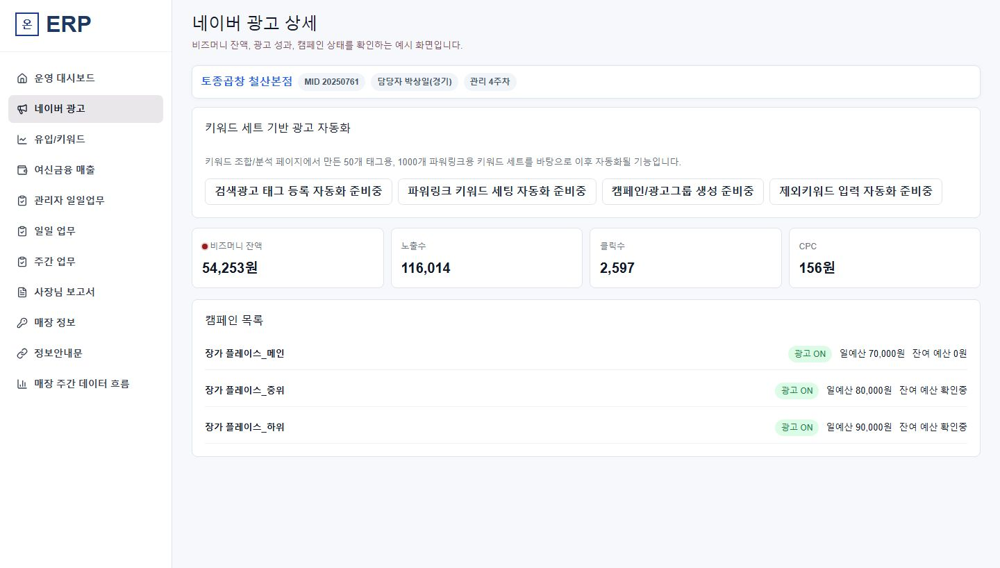

### 목적

매장별 검색광고 계정 연결, 비즈머니 잔액, 노출/클릭/CPC/광고비/평균순위와 캠페인 상태를 확인한다.

### 처리 로직

1. 매장을 선택한다.
2. 매장의 SearchAd 계정 참조를 서버에서 찾는다.
3. 잔액과 일별 성과를 읽어 스냅샷으로 저장한다.
4. 예산 부족, 성과 급락, 비활성 캠페인을 표시한다.
5. 자동화 기능은 `준비중`으로 두고 조회→추천→승인→실행 순서로 확장한다.

### 현재 저장/출력

- 검색량 조회 API 경로는 존재한다.
- 종합 광고 화면의 수치는 대부분 예시 데이터다.
- 비즈머니/성과 정기 저장 테이블과 계정별 실제 조회는 완료되지 않았다.

## 3. 유입/키워드

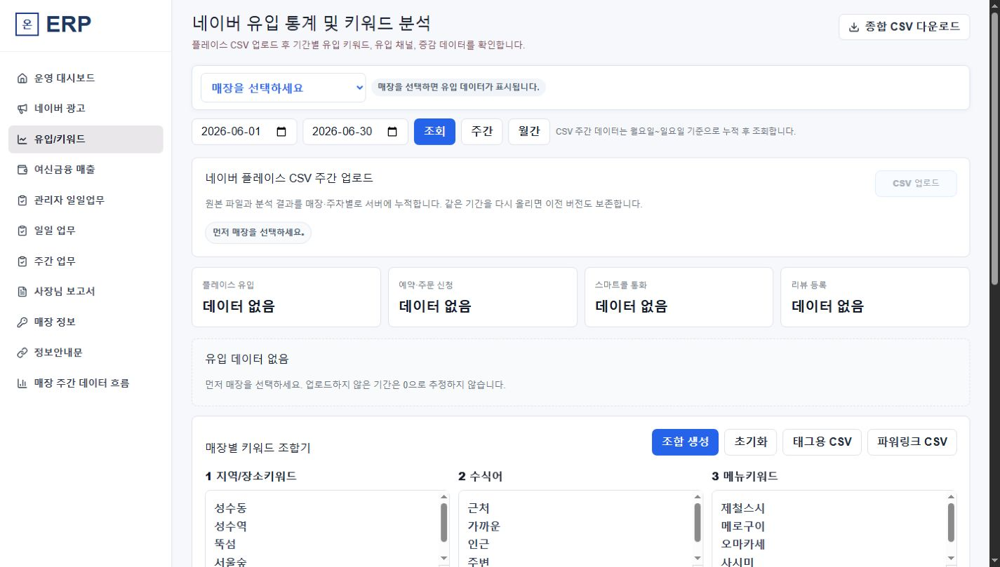

### 목적

플레이스 유입 통계, 키워드 조합, CSV 생성, 저경쟁 후보 탐색을 매장별로 수행한다.

### 입력

- 매장 선택 필수
- 시작일/종료일 또는 주간/월간
- 네이버 플레이스 주간 CSV
- 키워드 그룹 1~6
- 조합 체크박스, 공백 제거, 중복 제거

### 처리 로직

1. 매장 미선택 시 분석 박스는 비운다.
2. CSV 업로드 시 파일명/내부 기간을 읽고 월요일~일요일인지 검증한다.
3. SHA-256 중복 검사 후 원본은 Storage, 정규화 행은 DB에 저장한다.
4. 선택 기간의 최신 revision만 집계한다.
5. 키워드 조합은 선택된 규칙의 Cartesian product를 만들고 중복을 제거한다.
6. 태그는 열당 50개, 파워링크는 열당 1000개로 CSV를 생성한다.
7. 저경쟁 탐색은 지도 페이지 수 3 미만 후보를 먼저 추리고 그 후보만 검색량을 조회한다.

### 현재 저장/출력

- **실제 DB**: 플레이스 CSV 업로드, 원본 Storage, 키워드/채널/시간/요일 정규화.
- **브라우저 임시**: 일부 조합 결과와 꿀키워드 히스토리.
- **부분 구현**: 검색광고 검색량 API.
- **미완성**: 지도 페이지 수. Vercel 서버 fetch는 차단되므로 Playwright 워커로 이전해야 한다.

## 4. 여신금융 매출

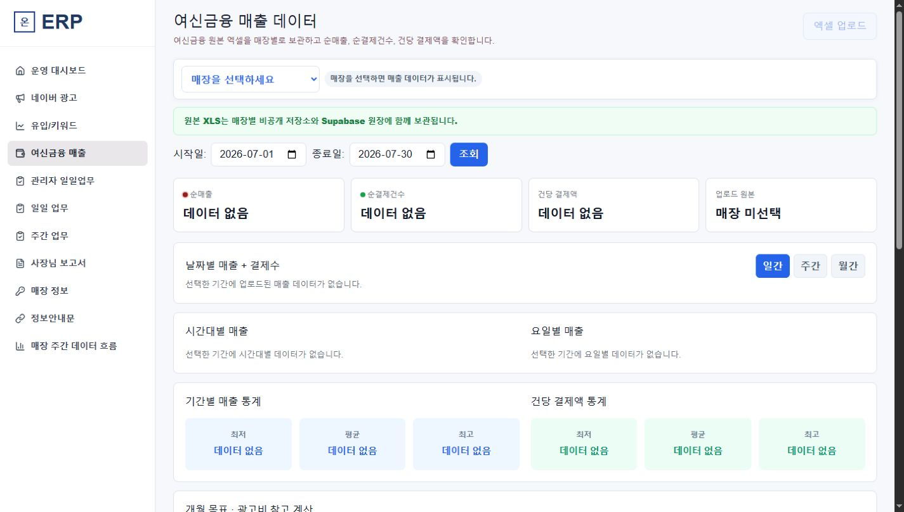

### 목적

매장별 승인/취소 원장을 누적하고 날짜·시간·요일별 순매출과 목표매출 시나리오를 보여준다.

### 입력

- 매장
- 여신금융 `.xls/.xlsx`
- 조회 기간
- 목표 개월, 목표 매출, 목표 재방문률, 목표 객단가, 테이블 수, 종합 CAC

### 처리 로직

1. 파일 헤더를 찾아 승인/취소를 정규화한다.
2. 중복 파일과 중복 거래를 감지한다.
3. 원본은 Storage, 정규화 거래는 DB에 저장한다.
4. 승인에서 연결된 취소를 차감해 순매출/순결제건을 계산한다.
5. 날짜, 시간, 요일, 평일/주말 그래프를 만든다.
6. 목표 입력값으로 현재부터 목표월까지 선형 목표와 필요 결제건을 역산한다.
7. 검증된 고객키가 있을 때만 신규/재방문 고객 계획을 활성화한다.

### 현재 저장/출력

- **실제 DB**: import, transaction, daily/hourly summary.
- **부분 구현**: 화면 업로드와 일부 집계.
- **예시/보완 필요**: 목표매출 그래프와 신규/재방문 수치.

## 5. 관리자 일일업무

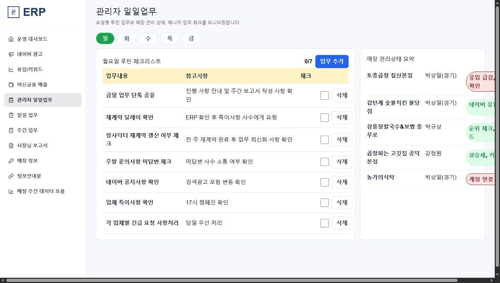

### 목적

대표/팀장이 요일별 공통 루틴과 매장 관리 위험을 점검한다.

### 입력

- 오늘 요일 자동 선택
- 월~금 탭
- 업무내용, 참고사항, 체크 여부

### 처리 로직

1. 현지 날짜 기준 오늘 요일 탭을 선택한다.
2. 체크박스는 매일 기본 미체크 상태에서 시작한다.
3. 업무/참고사항은 관리자가 추가·수정·삭제한다.
4. 당일 실행 기록을 날짜별 run으로 저장한다.
5. 우측에는 실제 대시보드 신호, 업무 누락, 마감 초과를 요약한다.

### 현재 저장/출력

- UI 기본 동작과 반응형 조정은 존재한다.
- 체크리스트/실행 이력은 DB 월별 원장으로 완성되지 않았다.
- 우측 위험 요약은 실제 전체 데이터 원장과 완전히 연결되지 않았다.

## 6. 일일업무

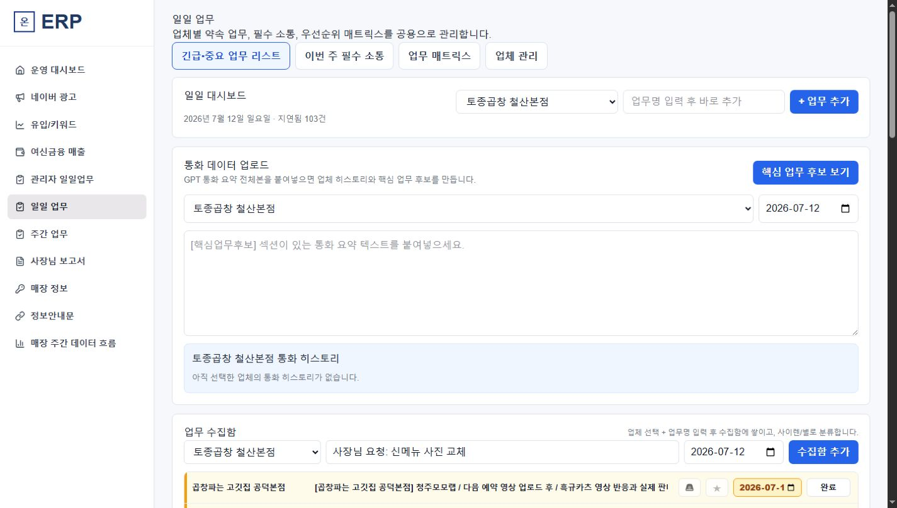

### 목적

사장님과 약속한 추가 업무를 놓치지 않고 아이젠하워 매트릭스로 처리하며 매장별 소통 이력을 남긴다.

### 입력

- 매장, 업무명, 마감일
- 긴급, 중요 토글
- 통화 요약 전체 텍스트와 통화일

### 처리 로직

1. 새 업무는 수집함으로 들어간다.
2. 긴급/중요 조합으로 4개 영역에 자동 분류한다.
3. 마감 경과는 진한 빨강, 당일은 주황, 미래는 기본색으로 표시한다.
4. 완료 시 완료일/수행자를 기록하고 일마감 및 매장 히스토리에 추가한다.
5. 통화 요약은 원문 히스토리 카드로 저장한다.
6. 핵심업무 후보를 추출하고 직원이 선택·수정·마감일 지정한 항목만 업무로 등록한다.
7. 일정 기간 추가 업무/소통이 없는 매장을 관리 요망으로 표시한다.

### 현재 저장/출력

- **현재**: 대부분 `localStorage` 기반으로 같은 브라우저에서만 유지된다.
- **목표**: `tasks`, `call_histories`, `call_task_candidates`, 상태 로그를 Supabase로 이전한다.

## 7. 주간업무

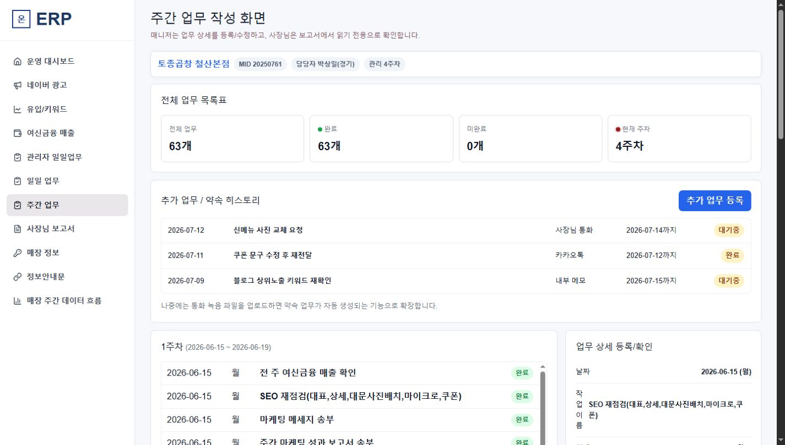

### 목적

매장 관리 시작일을 기준으로 1~4주 표준업무를 실행하고 사장님 보고서 증빙을 만든다.

### 처리 로직

1. 관리 시작일은 월요일만 선택한다.
2. 4주 템플릿으로 날짜/요일/업무를 생성한다.
3. 업무 추가·수정·삭제·순서 변경을 제공한다.
4. 업무 클릭 시 사진, 텍스트, 링크를 편집한다.
5. 완료 업무는 읽기 전용 사장님 보고서에 반영한다.
6. 월별 cycle을 만들어 과거 업무를 보존한다.

### 현재 저장/출력

- 화면과 예시 업무가 존재한다.
- 일부 편집은 브라우저 상태/임시 저장이다.
- 월별 cycle, 증빙 Storage, 보고서 반영은 DB 연결이 필요하다.

## 8. 사장님 보고서

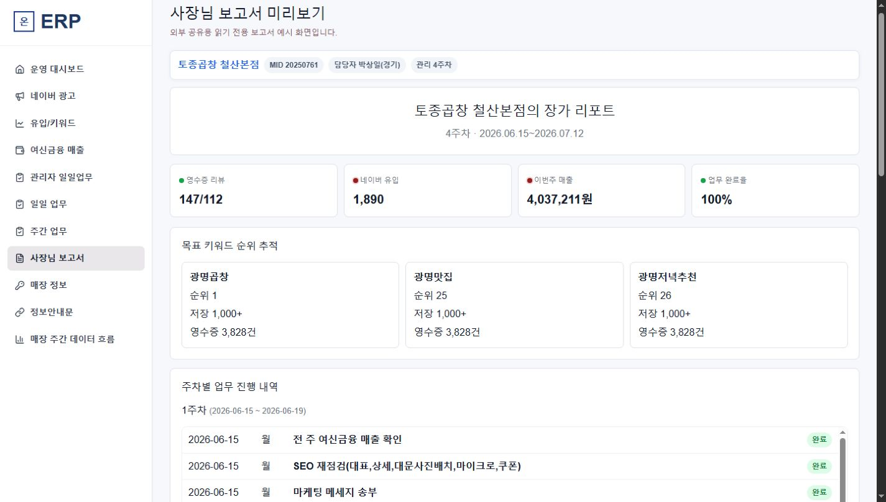

### 목적

사장님이 회사가 수행한 업무와 매장 성장 흐름을 쉽게 확인하는 읽기 전용 보고서다.

### 출력

- 현재 관리 주차와 기간
- 리뷰/설문/포인트/CRM 지표
- 목표 키워드 순위
- 플레이스 유입과 광고 성과
- 매출/결제 또는 검증된 고객 지표
- 1~4주 업무와 증빙
- 사장님 미션

### 처리 로직

1. 보고서 생성 시 당시 데이터를 snapshot으로 고정한다.
2. MID 또는 난수 토큰 기반 공유 URL을 발급한다.
3. 링크는 읽기 전용이며 만료/회수 가능해야 한다.
4. 내부 메모와 계정 비밀번호는 절대 노출하지 않는다.

### 현재 저장/출력

- 현재는 내부 미리보기와 예시 수치 중심이다.
- 공유 토큰, 인증, snapshot 생성은 미완성이다.

## 9. 매장 정보

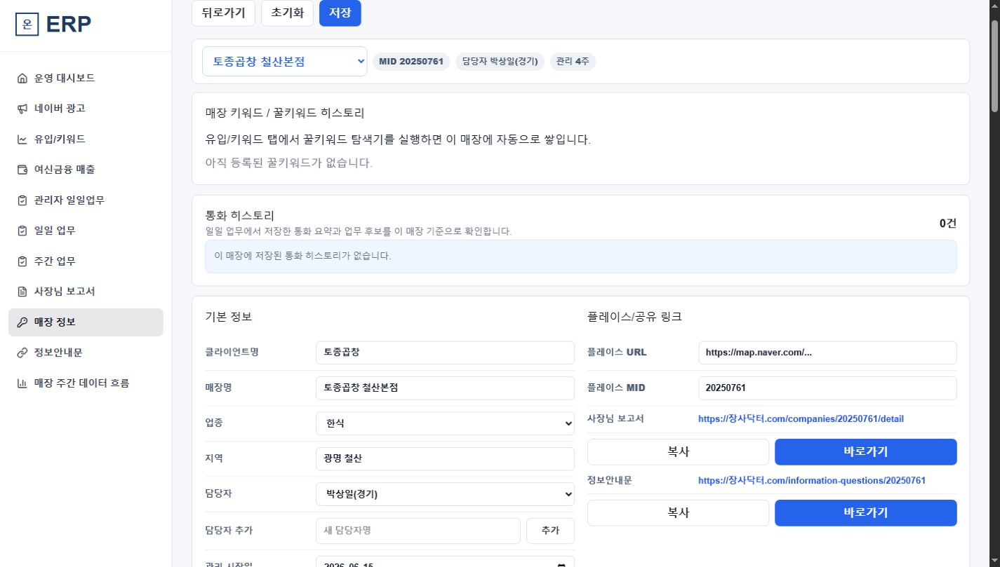

### 목적

매장 기본정보, 계정, 링크, 내부 메모, 영업 히스토리, 세팅 상태, 키워드 결과를 한곳에서 관리한다.

### 처리 로직

1. 좌측 상단 매장 선택기로 다른 매장을 전환한다.
2. 신규 매장은 개별 폼 또는 엑셀 일괄 등록으로 생성한다.
3. 담당자/업종은 관리자 관리 목록에서 선택한다.
4. 관리 시작일은 월요일만 허용하고 계약은 4주 단위 옵션으로 선택한다.
5. 내부 메모는 날짜별 레코드로 저장하고 캘린더 표시를 제공한다.
6. 매장 세팅은 월별 탭, 진행률, 마감일, 완료, 비포/애프터 사진을 가진다.
7. 광고 채널 체크와 전문사진/먹플루언서 진행일을 이력으로 누적한다.
8. 꿀키워드 결과는 등록 여부를 체크해 매장 키워드 원장으로 승격한다.

### 현재 저장/출력

- 매장 목록 GET/추가 POST API가 있다.
- 상세 프로필, 계정, 메모, 세팅, 꿀키워드 상당수는 `localStorage`다.
- 계정 비밀번호를 평문 저장하는 완성 기능은 없다. 암호화/권한/감사 로그가 먼저다.

## 10. 정보안내문

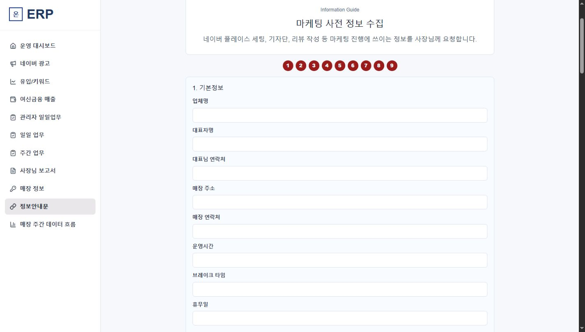

### 목적

관리 시작 전 사장님에게 매장 정보와 계정을 받아 초기 전략과 세팅 방향을 만드는 외부 작성 페이지다.

### 섹션 로직

- 번호 버튼을 누르면 해당 섹션으로 스크롤한다.
- 전체 작성은 초록, 일부 작성은 주황, 미작성은 진한 빨강이다.
- 기본 질문 양식은 관리자가 추가·수정·삭제·순서 변경할 수 있다.
- 5번 마케팅 고민 다음에 업력/이력, 창업 계기, 브랜드 스토리, 특별 식재료, 방송 출연 여부를 둔다.
- 의미 없는 매장 사진 질문은 제거하고 필요한 증빙만 받는다.
- 제출 답변 중 계정 정보는 권한 있는 매장 정보로 동기화한다.

### 현재 저장/출력

- 현재 폼은 예시/브라우저 상태 중심이다.
- 질문 템플릿, 제출본, 답변 DB, MID 공유 링크는 미완성이다.

## 11. 매장 주간 데이터 흐름

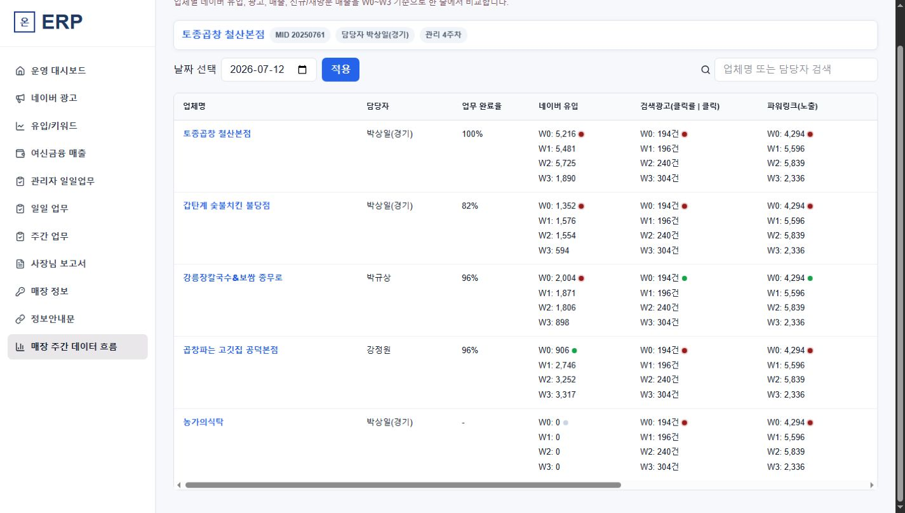

### 목적

선택 매장의 유입, 광고, 매출, 신규/재방문 또는 결제 지표를 같은 주차 축으로 비교한다.

### 처리 로직

1. 상단 매장 정보는 고정한다.
2. 기준 주차를 중심으로 W0~W3를 같은 폭으로 정렬한다.
3. 각 지표의 원본 기간과 업로드 상태를 표시한다.
4. 증감량과 증감률을 함께 보여준다.
5. 매장 선택을 바꾸면 모든 패널이 같은 `store_id`로 다시 조회된다.

### 현재 저장/출력

- 현재 화면은 시각 예시 중심이다.
- 플레이스, 카드, 광고, 업무를 한 번에 반환하는 통합 API와 스냅샷이 필요하다.

## 12. 아직 별도 화면이 필요한 영역

- 리뷰 AI 분석기
- QR 이벤트/CRM 운영
- 고객 DB와 동의 관리
- 사장님 미션/일마감
- 월간 성장/EXIT 리포트

