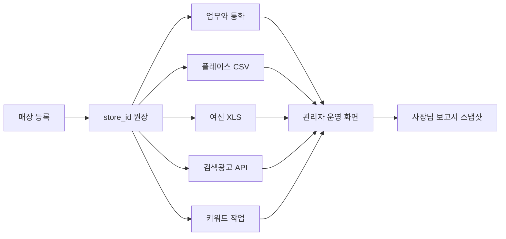

# 현재 개발 상태와 다음 시작점

기준일: 2026-07-19  
이 문서는 다른 GPT 또는 새 Codex 대화에서도 현재 상태를 오해하지 않고 개발을 이어가기 위한 실행 지침이다.

## 1. 지금까지 실제로 만든 것

### 제품과 화면
- 맞춤장사 OS의 전체 PRD와 11개 핵심 화면 흐름을 정리했다.
- 운영 대시보드, 네이버 광고, 유입/키워드, 여신금융 매출, 관리자 일일업무, 일일업무, 주간업무, 사장님 보고서, 매장정보, 정보안내문, 매장 주간 데이터 흐름 화면이 배포되어 있다.
- 현재 UI는 최종 디자인이 아니라 업무 흐름과 정보 배치를 검증하는 실무형 프로토타입이다.

### 실제 데이터 기반
- `erp_stores` 기반 매장 원장 API가 있다.
- 네이버 플레이스 주간 CSV를 Storage에 보관하고, 키워드·채널·시간·요일 데이터를 정규화해 Supabase에 저장하는 기반이 있다.
- 동일 기간 파일의 중복 방지와 수정 업로드 이력을 고려한 마이그레이션이 있다.
- 여신금융 XLS 원본을 Storage에 보관하고 카드 거래 원장으로 정규화하는 기반이 있다.
- 카드 거래의 날짜별·시간별 집계 뷰가 있다.
- 네이버 검색광고 키워드 검색량을 조회하는 서버 라우트가 있다.
- Vercel 배포와 GitHub 저장소가 연결되어 있다.

## 2. 아직 완성되지 않은 것

### 공통 기반
- Supabase Auth 기반 관리자·직원·사장님 권한과 RLS가 없다.
- 현재 원격 Supabase 스키마를 기준으로 한 완전한 baseline migration이 없다.
- 일부 화면 상태가 `localStorage`와 예시 데이터에 남아 있어 다른 PC나 직원과 공유되지 않는다.

### 매장과 업무
- 매장 전체 CRUD, 엑셀 일괄 등록, 담당자·업종 관리가 완성되지 않았다.
- 일일업무, 통화 히스토리, 주간업무, 세팅 체크, 내부 메모가 모두 DB 원장으로 연결되지 않았다.
- 관리자 루틴 체크리스트와 매장 관리상태 요약이 실제 매장 데이터에서 자동 계산되지 않는다.

### 분석과 보고서
- 운영 대시보드는 매장과 최근 플레이스 유입 일부만 실제 조회한다.
- 비즈머니, 광고 성과, 여신 매출, 위험 신호가 하나의 통합 API로 연결되지 않았다.
- 여신금융의 마스킹 카드번호만으로 실제 고객을 확정할 수 없으므로 신규·재방문은 아직 검증된 지표가 아니다.
- 목표매출 기반 필요 고객수 그래프는 설계는 있으나 검증된 고객 식별키와 계산 엔진이 연결되지 않았다.
- 사장님 보고서 스냅샷, 공유 토큰, PDF가 없다.
- 정보안내문 템플릿·응답·외부 MID 링크가 DB로 완성되지 않았다.

### 키워드와 광고
- 키워드 조합과 CSV 출력은 있으나 분석 작업의 영속 큐와 이력 관리가 없다.
- 네이버 지도 페이지 수 확인은 Vercel 서버 요청 방식으로 차단될 수 있다. Playwright 기반 별도 워커가 필요하다.
- 비즈머니와 계정 성과 조회, 자동 광고 세팅은 완성되지 않았다.
- 광고 변경은 향후에도 `조회 -> 저장 -> 추천 -> 직원 승인 -> 변경` 순서로 구현해야 한다.

## 3. 진척이 느려진 원인

1. 화면을 먼저 넓게 만든 뒤 각 화면의 단일 데이터 원장을 늦게 붙여 Supabase, `localStorage`, 예시 데이터가 섞였다.
2. 네이버 지도 브라우저 자동화는 Vercel 함수에서 안정적으로 돌리기 어려운데 화면 요청 방식부터 만들었다.
3. 마스킹 카드번호를 고객으로 간주할 수 있는지 검증하기 전에 신규·재방문 UI가 앞서갔다.
4. 큰 `app/page.tsx`에 기능이 집중되어 변경과 회귀 테스트 비용이 커졌다.
5. Git 작성자 계정과 Vercel 연결 문제로 여러 배포가 Blocked 상태가 된 이력이 있다.

## 4. 정확한 재개 지점

다음 개발은 새 화면을 추가하지 말고 **PR 1: Supabase 기준선과 권한 기반**부터 시작한다.

### PR 1 - DB 기준선, Auth, RLS
- 원격 Supabase 스키마를 dump하여 baseline migration으로 고정한다.
- `organizations`, `profiles`, `store_members`를 추가한다.
- 관리자 전체 접근, 직원 담당 매장 접근, 사장님 자기 매장 읽기 정책을 만든다.
- 서버 전용 키와 브라우저 공개 키의 사용 경계를 정리한다.
- 완료 기준: 로그인 사용자에 따라 허용된 매장만 API에서 조회된다.

### PR 2 - 매장 원장 완성
- 매장 생성·수정·보관, 담당자, 업종, 4주 계약 주기, MID를 DB에 저장한다.
- 엑셀 일괄 등록을 검증·미리보기·승인 방식으로 만든다.
- 외부 계정 비밀번호는 평문 DB 저장을 금지하고 별도 보안 저장 또는 운영 링크 방식으로 결정한다.
- 완료 기준: 새 매장이 모든 매장 선택기와 대시보드에 즉시 나타난다.

### PR 3 - 업무·통화·세팅 체크 DB 이관
- 일일업무, 완료 히스토리, 통화 원문/요약/업무후보, 주간업무, 내부 메모, 월별 세팅 체크를 DB로 옮긴다.
- 증빙 이미지와 세팅 전후 이미지는 Storage에 저장한다.
- 완료 기준: 다른 브라우저에서 동일한 업무·히스토리·체크 상태가 보인다.

### PR 4 - 플레이스·여신 분석 화면 완전 연결
- Place CSV와 카드 XLS 업로드 결과를 현재 화면의 표와 그래프에 실제 연결한다.
- 기간이 없는 구간은 0이 아니라 `데이터 없음`으로 표시한다.
- 업로드 파일, 파싱 결과, 집계 결과를 분리하고 재처리 가능하게 한다.
- 완료 기준: 샘플 파일 업로드 후 새로고침해도 주간 유입과 날짜별 매출이 유지된다.

### PR 5 - 키워드 백그라운드 작업
- 조합 결과를 DB에 저장한다.
- 지도 페이지 수 확인은 Playwright 워커에서 실행하고 3페이지 미만 키워드만 검색량을 조회한다.
- 작업 상태, 실패 사유, 재시도, 결과 이력을 저장한다.
- 완료 기준: 다른 페이지로 이동해도 작업이 계속되고 결과가 선택 매장에 누적된다.

### PR 6 - 정보안내문과 사장님 보고서
- 질문 템플릿, 매장별 응답, 섹션 완성도를 DB화한다.
- MID 기반 외부 입력 링크와 토큰 기반 읽기 전용 보고서 링크를 만든다.
- 보고서는 업무, 유입, 광고, 매출 데이터를 특정 시점 스냅샷으로 저장한다.
- 완료 기준: 외부 링크에서 다른 매장 데이터에 접근할 수 없고, 과거 보고서가 이후 데이터 변경에도 유지된다.

## 5. GPT에서 만든 코드를 가져오는 규칙

1. 먼저 `그대로 재사용 / 리팩터링 후 이식 / 샘플로만 보관`으로 분류한다.
2. HTML 전체를 붙이지 않고 파서, 집계 함수, 차트 데이터 변환처럼 입력과 출력이 분명한 단위로 가져온다.
3. 실제 샘플 CSV/XLS를 회귀 테스트 fixture로 등록한다.
4. 새 기능은 `components`, `lib`, `app/api`의 기능 경계에 맞춰 분리한다.
5. 브라우저 `localStorage`가 아니라 Supabase 원장을 기본으로 한다.
6. 로컬 빌드와 실제 Vercel 화면을 모두 확인한 후 커밋한다.

## 6. 제품 전체 데이터 흐름

## 7. 다음 대화 시작 문구

> `docs/handoff-2026-07-19/11_CURRENT_STATE_AND_NEXT.md`와 `02_DATABASE_SPEC.md`를 읽고 PR 1만 시작해줘. 원격 Supabase 실제 스키마를 먼저 확인하고 baseline migration, Auth, RLS를 작은 변경으로 구현해. 새 화면은 추가하지 말고 빌드와 권한 테스트 후 커밋·푸시해줘.

이 순서를 지키면 GPT에서 만든 기능도 잃지 않으면서, 최종적으로 Codex에서 하나의 맞춤장사 OS로 안전하게 합칠 수 있다.
